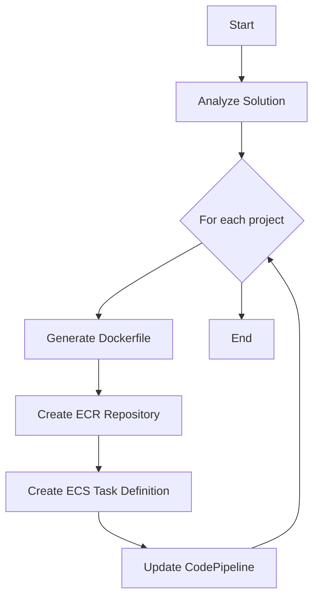
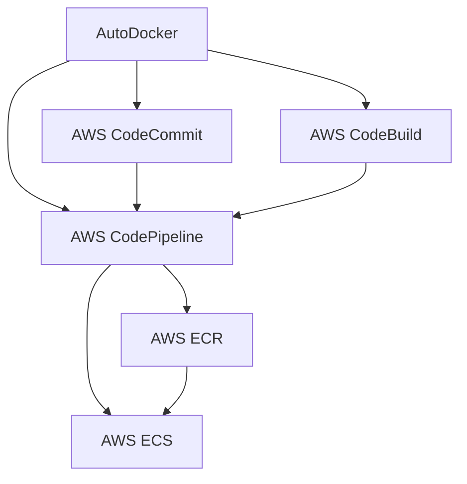

# AutoDocker

AutoDocker is a tool designed to automatically build Docker files for .NET solutions, eliminating the need for developers to manually create and maintain Docker files. It uses reflection of .NET solutions to generate appropriate Docker files, streamlining the containerization process.

## Features

- Automatic Docker file generation for .NET solutions
- Integration with AWS services for deployment
- Support for multiple projects within a solution
- Automatic creation of ECR repositories and ECS tasks

## Workflow

## Architecture

## How it works

1. AutoDocker analyzes the .NET solution structure
2. For each project, it generates an appropriate Dockerfile
3. It creates necessary AWS resources (ECR repositories, ECS tasks)
4. Sets up a CI/CD pipeline using AWS CodePipeline
5. Automates the build and deployment process

## Getting Started

[Instructions on how to use AutoDocker, including prerequisites and setup steps]

## Contributing

[Guidelines for contributing to the project]

## License

This project is licensed under the Apache License 2.0 - see the [LICENSE](LICENSE) file for details.